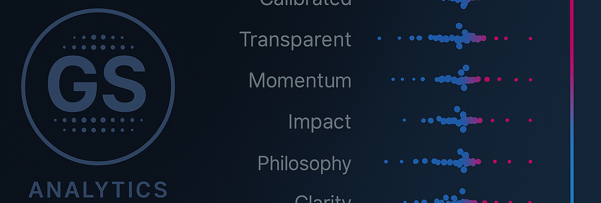

<p align="center">
  
  <br>
  <em>Automated Data Pipeline: Usage Guide</em>
</p>

<p align="center">
  
  
  
</p>

## 🧩 Purpose

The `run_story.sh` script is a convenience wrapper that automates the data pipeline for any given "story." It orchestrates a three-step process using a file naming convention:

1.  **Build**: Automatically finds and executes any `build_*.sql` scripts within a story's `sql_sessions` directory.
2.  **Upload**: Runs the centralized `scripts/gsheets_uploader.py` script. This script reads data from the newly created views (as defined in `stories_config.yaml`) and uploads it to the designated Google Sheet.
3.  **Cleanup**: Automatically finds and executes any `cleanup_*.sql` scripts to `DROP` the temporary views.

___

## 🚀 How to Run the Pipeline

Execute the script from the root of the repository, passing the desired `story_name` as an argument.

**Syntax:**
```bash
./run_story.sh <story_name>
```
<details>
<summary><strong>Examples:</strong></summary>

<br>

*   **To run the pipeline for `story_01_inventory_accuracy`:**
    ```bash
    ./run_story.sh story_01_inventory_accuracy
    ```
    This command will:
    1.  Create the `inventory_audit` view.
    2.  Upload its contents to the Google Sheet specified by `GDRIVE_SHEET_ID_story_01`.
    3.  Drop the `inventory_audit` view.

*   **To run the pipeline for `story_05_vp_request`:**
    ```bash
    ./run_story.sh story_05_vp_request
    ```
    This command will:
    1.  Run all SQL scripts to create views prefixed with `dash_`.
    2.  Find all of those `dash_` views, and upload each one to a separate tab in the Google Sheet specified by `GDRIVE_SHEET_ID_story_05`.
    3.  Drop all `dash_` views.

___

</details>

## ⚙️ One-Time Setup

Before running the pipeline for the first time, you need to configure your credentials and story settings.

1.  **Create `secrets.yaml`**:
    *   Rename `secrets_template.yaml` to `secrets.yaml`.
    *   Follow the instructions inside `secrets.yaml` to add your Google Cloud service account credentials and the IDs of your target Google Sheets.
    *   **This file is ignored by Git and should never be committed.**

2.  **Create `stories_config.yaml`**:
    *   Rename `stories_config_template.yaml` to `stories_config.yaml`.
    *   Review the file to ensure the story names and view prefixes match your project structure. You typically won't need to change this unless you add a new story.

3.  **Install Dependencies**:
    *   Make sure you have installed the required Python packages: `pip install -r requirements.txt`.


## 📊 Best Practices for Google Sheets Setup

To ensure your pipeline is robust and your dashboards don't break, it is critical to separate your raw data from your presentation layer (charts, slicers, etc.).

The uploader script is designed to aggressively overwrite data, even deleting and recreating sheets. If your visuals point directly to a sheet managed by the script, they will break.

### The Two-Sheet Architecture

1.  **Data Sheet (e.g., `inventory_audit_data`)**:
    *   This is the sheet the Python script writes to. Its name should match the `sheet_name` in your `stories_config.yaml`.
    *   **Do not build anything on this sheet.** Treat it as a temporary, machine-managed data source.

2.  **Dashboard Sheet (e.g., `Dashboard`)**:
    *   This is where you build all your charts, slicers, and pivot tables.
    *   In cell `A1` of this sheet, pull data from the data sheet using a formula. The simplest is `='inventory_audit_data'!A:Z`. A more robust option is `=QUERY(inventory_audit_data!A:Z, "SELECT * WHERE A IS NOT NULL")`.
    *   Point all your charts and slicers to the data range **on this `Dashboard` sheet**.

This setup decouples your presentation from the data ingestion, allowing the pipeline to run reliably without breaking your workbook.

> **Note for Existing Workbooks:** If you are migrating a dashboard from an old sheet, the process is simple: copy your charts and slicers into the new `Dashboard` sheet, then update their data ranges to point to the new local data. This one-time setup ensures long-term stability.

## 📚 Adding a New Story

To integrate a new story (e.g., `story_07_new_story`) into this automated workflow, follow these steps:

1.  **Create Story Directory and SQL Scripts**:
    *   Create a new directory for your story (e.g., `story_02_new_feature`).
    *   Inside, create a `sql_sessions` subdirectory.
    *   Add your SQL scripts, following the naming convention:
        *   `build_*.sql` for creating views.
        *   `cleanup_*.sql` for dropping views.

2.  **Configure the Story Export**:
    *   Open your `stories_config.yaml` file.
    *   Add a new entry for your story.
        *   **For a single view**:
            ```yaml
            story_07_new_story:
                sheet_id_var: 'GDRIVE_SHEET_ID_story_07'
                'exports': [
                    {'db_view': 'your_view_name', 'sheet_name': 'Your Desired Tab Name'}
                ]
            ```
        *   **For multiple views based on a prefix**:
            ```yaml
            story_07_new_story:
                sheet_id_var: 'GDRIVE_SHEET_ID_story_07'
                'view_prefix': 'your_prefix_' # Will upload all views like your_prefix_kpi, etc.
            ```

3.  **Add Sheet ID to Secrets**:
    *   Open your `secrets.yaml` file.
    *   Add the new `GDRIVE_SHEET_ID_story_07` variable and paste in the corresponding Google Sheet ID.

___

You can now run `./run_story.sh story_07_new_story` to execute the full pipeline for your new story.

<p align="center">
  <a href="README.md">🏠 <b>Main README</b></a>
  &nbsp;·&nbsp;
  <a href="USAGE.md">📖 <b>Usage Guide</b></a>
  &nbsp;·&nbsp;
  <a href="storycrafting.md">🛠️ <b>Storycrafting</b></a>
  &nbsp;·&nbsp;
  <a href="sample_ai_prompt.md">🤖 <b>AI Prompt Guide</b></a>
</p>

<p align="center">
  <sub>✨ SQL · Python · Storytelling ✨</sub>
</p>